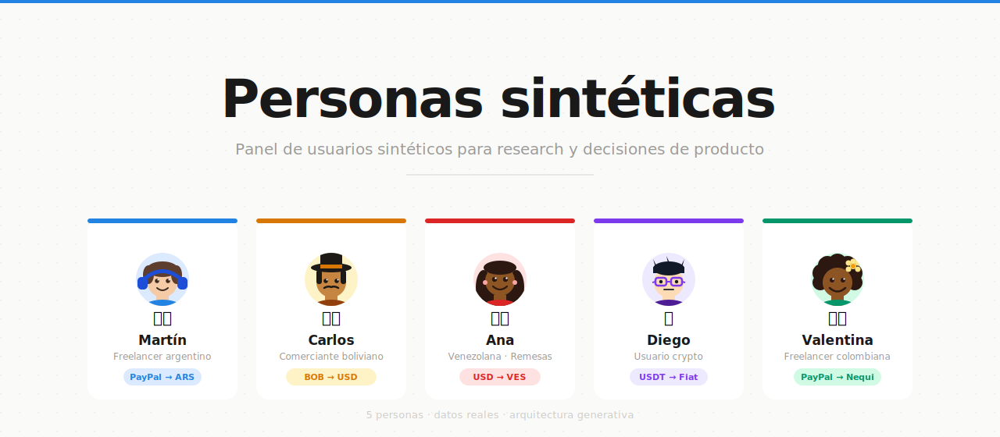

# Panel de Usuarios Sintéticos — Saldoar



Un sistema de personas simuladas por IA para testear hipótesis, validar copy y priorizar features cuando no hay tiempo o recursos para investigación con usuarios reales.

---

## Qué es esto

Cuando el equipo necesita saber cómo reaccionaría un usuario a un cambio, un mensaje o un flujo nuevo, normalmente hay dos opciones: esperar a tener usuarios disponibles, o asumir. Este sistema ofrece una tercera: consultarle al panel.

El panel está compuesto por cinco personas sintéticas que representan los segmentos principales de Saldoar. Cada una tiene su propio worldview, su forma de razonar y sus miedos. Cuando el equipo hace una consulta, cada persona responde en primera persona — no como analista que describe al usuario, sino como el usuario hablando.

**Lo que esto no es:** no reemplaza hablar con usuarios reales. Complementa cuando no hay acceso. Las respuestas son orientativas, no predictivas.

---

## Arquitectura

El sistema tiene tres capas que trabajan juntas. Entender la separación entre ellas es lo que permite que escale sin mantenimiento.

### Capa 1 — Personas (`/personas/`) — fuente primaria

Cada persona define su **worldview completo**: quién es, qué le importa, qué le da miedo y, fundamentalmente, **cómo razona**. Con un patrón de razonamiento definido, la persona puede responder a cualquier situación nueva — una feature que no existe todavía, un copy hipotético, un flujo que nunca se probó — sin necesitar datos previos sobre esa situación.

Los perfiles **no cambian cuando llegan datos nuevos**. Son definiciones de carácter, no repositorios de citas.

### Capa 2 — Datos (`/datos/`) — evidencia que calibra

Los archivos en `/datos/` contienen lo que usuarios reales dijeron: NPS, tickets de soporte, entrevistas, encuestas. Se agregan en cualquier momento sin tocar ningún perfil.

Cuando hay datos relevantes para una consulta, la persona los usa como evidencia que concreta su respuesta. Cuando no hay nada que aplique, la persona responde igual desde su worldview.

### Capa 3 — Servidor MCP (`/mcp_server/`) — motor de acceso

El servidor MCP conecta las personas y los datos con las herramientas del equipo. Corre localmente, expone cuatro herramientas, y maneja internamente cómo recuperar la evidencia correcta para cada consulta.

```
Consulta del equipo (desde Claude Code, Cursor, u otro cliente MCP)
        ↓
Servidor MCP recibe la consulta
        ↓
Personas: carga los perfiles completos (worldview + razonamiento)
        ↓
Datos: búsqueda semántica — recupera solo los fragmentos más relevantes
        ↓
Servidor devuelve el contexto armado (no llama a ninguna API propia)
        ↓
Claude Code genera la respuesta usando la cuenta del usuario
        ↓
Respuesta al equipo
```

**Regla de diseño que no se rompe:** los archivos de personas no contienen citas de datos ni referencias a NPS. Eso vive en `/datos/`. La persona tiene fricciones y miedos definidos desde su perfil — si los datos los confirman, los menciona al responder; si no hay datos, responde igual.

---

## Cómo funciona técnicamente el servidor MCP

### Búsqueda semántica en lugar de carga completa

El servidor no inyecta todos los datos en cada consulta. En su lugar, los datos están indexados en un vector store local (ChromaDB) usando el modelo de embeddings `all-MiniLM-L6-v2`. Cuando llega una consulta, el servidor recupera semánticamente los fragmentos más relevantes — verbatims de NPS, razones de cancelación, resultados de encuesta — y solo esos van al contexto de Claude.

Esto significa que a medida que el corpus de datos crece (más NPS, más entrevistas, más tickets), la calidad no se degrada y el costo por consulta no aumenta.

### Actualización automática del índice

El servidor observa el directorio `/datos/` en tiempo real. Cuando detecta un cambio en cualquier archivo — incluyendo los que llegan via `git pull` — reconstruye el índice de embeddings automáticamente en background, sin interrumpir el servicio.

```
git push (datos nuevos)
        ↓
Compañero hace git pull
        ↓
File watcher detecta el cambio en /datos/
        ↓
Índice se reconstruye en background (~segundos)
        ↓
Próxima consulta ya usa los datos nuevos
```

### El índice es local, no se sube al repo

El índice de ChromaDB (`mcp_server/chroma_db/`) se genera en la máquina de cada usuario al iniciar el servidor por primera vez. El repo solo contiene los archivos fuente — cada copia local tiene su propio índice actualizado.

### Primera ejecución

La primera vez que se instala, el servidor descarga el modelo de embeddings (~90MB, una sola vez) y construye el índice. Las ejecuciones siguientes reutilizan el modelo en cache y el índice existente.

---

## Las personas del panel

| Persona | Segmento | País | Prioridades |
|---|---|---|---|
| **Martín / Laura** | Freelancer — convierte USD a ARS (PayPal, Wise) | 🇦🇷 Argentina | Velocidad, tasa clara, proceso simple |
| **Carlos** | Comerciante — compra USD para su negocio | 🇧🇴 Bolivia | Consistencia, predecibilidad, sin sorpresas |
| **Ana** | Remesas — envía dinero a su familia en Venezuela | 🇻🇪 Venezuela | Certeza de que llega, monto completo, método accesible |
| **Diego** | Crypto — convierte USDT/BTC a moneda local | 🌐 Todos | Sin KYC largo, spread transparente, proceso simple |
| **Valentina** | Freelancer — convierte USD a COP (Nequi, Daviplata) | 🇨🇴 Colombia | Claridad del proceso, compatible con Nequi |

Ver `/personas/personas.md` para el índice completo, estado de datos por persona y segmentos en lista de espera.

---

## Datos disponibles

El panel está actualmente alimentado con:

| Fuente | Archivo | Contenido |
|---|---|---|
| NPS interno | `datos/nps/nps_historico.md` | 40 respuestas con verbatim, sin segmentar por usuario |
| Trustpilot | `datos/nps/nps_trustpilot_historico.md` | ~25 comentarios públicos |
| Cancelaciones | `datos/soporte/soporte_cancelaciones.md` | 31 razones de pedidos cancelados |
| Encuesta | `datos/entrevistas/encuesta_usuarios_2026.md` | Encuesta cuantitativa de usuarios activos y ex-usuarios |

**Para mejorar la calidad con el tiempo:**
- Entrevistas cualitativas (3-5 por segmento) — mayor impacto en profundidad de respuesta
- Datos directos de Carlos y Diego — actualmente sin verbatims identificados de esos segmentos
- Cualquier dato nuevo se agrega a `/datos/` y el sistema lo incorpora automáticamente

---

## Tres formas de usar este repositorio

### Opción A — Servidor MCP (recomendada para el equipo)

El servidor MCP expone las personas como herramientas disponibles en Claude Code, Cursor, y cualquier cliente compatible con MCP. Una vez instalado, el equipo consulta el panel sin abrir el repo.

```bash
# 1. Clonar el repo
git clone github.com/ferquirogase/personas-sinteticas
cd personas-sinteticas

# 2. Instalar dependencias
pip install -r mcp_server/requirements.txt

# 3. Abrir en Claude Code — el .mcp.json activa el servidor automáticamente
claude .
```

> No requiere API key propia. El servidor prepara el contexto y Claude Code lo ejecuta con la cuenta de cada usuario.

**Herramientas disponibles:**

| Herramienta | Para qué sirve |
|---|---|
| `ask_panel` | El panel completo responde — el orquestador elige las personas relevantes |
| `ask_persona` | Una persona específica responde (martin, laura, carlos, ana, diego, valentina) |
| `user_audit` | Auditoría estructurada de una feature o copy — reacción, fricción, veredicto |
| `detect_gap` | Detecta si una consulta implica un segmento no cubierto por el panel |
| `rebuild_index` | Fuerza reindexación manual si el servidor lleva mucho tiempo corriendo |

**Para mantenerse actualizado:** hacer `git pull` es suficiente. El servidor detecta los cambios en `/datos/` y reconstruye el índice automáticamente.

### Opción B — Claude Code (sin configuración)

1. Abrir la carpeta del repo en Claude Code
2. Escribir la consulta directamente — el sistema responde desde las personas relevantes
3. No hace falta configurar nada más

El archivo `CLAUDE.md` configura el comportamiento del orquestador automáticamente.

### Opción C — Claude Projects (sin instalación)

1. Crear un nuevo Project en Claude → `Projects → New Project`
2. Copiar el contenido de `INSTRUCCIONES_CLAUDE.md` en el campo *Project instructions*
3. Subir como documentos del proyecto todos los `personas/persona_*.md`, `contexto/audiencia.md` y los archivos de `/datos/`
4. Compartir el Project con el equipo

> Cuando se actualicen datos o personas, re-subir los archivos modificados al Project manualmente.

---

## Ejemplos de consultas

```
"¿Cómo reaccionaría cada persona a una función de pago único (sin fragmentar)?"

"Tenemos dos versiones del mensaje de confirmación de envío. ¿Cuál genera menos ansiedad?"

"Estamos pensando en agregar un paso de verificación de identidad al onboarding. ¿Qué pasa?"

"¿Qué debería decir la notificación de 'dinero en camino' para no generar ansiedad?"
```

Ver `/consultas/_TIPOS_DE_CONSULTA.md` para plantillas y ejemplos de output esperado.

---

## Estructura del repositorio

```
personas/
  _PLANTILLA_PERSONA.md            ← usar para crear personas nuevas
  personas.md                      ← índice del panel y segmentos en lista de espera
  persona_freelancer_argentino.md  → Martín / Laura
  persona_comerciante_boliviano.md → Carlos
  persona_venezolano_remesas.md    → Ana
  persona_usuario_crypto.md        → Diego
  persona_freelancer_colombiano.md → Valentina

prompts/
  panel_completo.md       ← orquestador del panel completo
  martin_freelancer.md    ← Martín standalone
  laura_freelancer.md     ← Laura standalone (misma persona, voz femenina)
  carlos_comerciante.md
  ana_remesas.md
  diego_crypto.md
  valentina_freelancer.md

datos/
  nps/
    nps_historico.md              ← NPS interno (40 respuestas)
    nps_trustpilot_historico.md   ← Comentarios Trustpilot (~25)
  soporte/
    soporte_cancelaciones.md      ← Razones de cancelación (31 registros)
  entrevistas/
    encuesta_usuarios_2026.md     ← Encuesta cuantitativa

contexto/
  audiencia.md       ← segmentación, jobs to be done, casos de uso
  prueba-social.md   ← métricas de credibilidad y testimonios

consultas/
  _TIPOS_DE_CONSULTA.md   ← guía de preguntas útiles con ejemplos

decisiones/
  _FORMATO_DECISION.md    ← formato para registrar decisiones tomadas con el panel

mcp_server/
  server.py               ← servidor MCP con las 5 herramientas del panel
  vector_store.py         ← índice semántico con ChromaDB + file watcher
  requirements.txt        ← dependencias Python

.mcp.json                 ← configura el servidor MCP en Claude Code automáticamente
```

---

## Cómo agregar datos nuevos

Agregar datos **no requiere editar ningún perfil de persona** ni reiniciar el servidor. Solo:

1. Crear el archivo en la carpeta correspondiente siguiendo el formato:
   - NPS → `datos/nps/nps_YYYY-MM.md` (ver `_FORMATO_NPS.md`)
   - Soporte → `datos/soporte/soporte_YYYY-MM.md` (ver `_FORMATO_SOPORTE.md`)
   - Entrevistas → `datos/entrevistas/entrevista_YYYY-MM.md` (ver `_FORMATO_ENTREVISTA.md`)

2. Hacer `git push`.

3. Cada miembro del equipo hace `git pull` — el servidor detecta el cambio y reindexed automáticamente.

---

## Cómo agregar una persona nueva

1. Copiar `personas/_PLANTILLA_PERSONA.md` y completar el perfil — especialmente la sección **"Cómo razona"**, que es lo que le da capacidad generativa
2. Crear el prompt standalone en `/prompts/` siguiendo el formato de los existentes
3. Agregar la persona al índice en `personas/personas.md`
4. Agregar la persona a la tabla de `CLAUDE.md` y a `mcp_server/server.py` (en `PERSONA_FILES`)

La nueva persona funciona desde el día uno con todos los datos que ya existen en `/datos/`.

---

## Límites del sistema

- **No predice comportamiento cuantitativo:** las personas pueden decir qué les preocupa o qué prefieren, pero no cuánto pagarían, su probabilidad de churn, o un NPS exacto. Eso requiere datos reales.
- **No reemplaza investigación cualitativa:** una entrevista de 30 minutos aporta profundidad que ningún perfil puede simular completamente. El panel es para cuando no hay acceso a usuarios reales.
- **La calidad de Carlos y Diego es menor:** los datos actuales no tienen verbatims identificados directamente de esos segmentos. Sus respuestas son más orientativas que las de Martín y Ana.
- **No para decisiones de alto riesgo:** cambios de precio, pivots de negocio o eliminación de features core requieren validación con usuarios reales.
